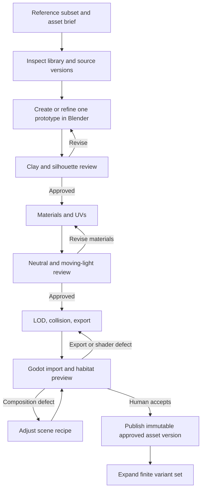

# Valley environment: art direction, Blender production, and implementation plan

**Project:** Fantasy Game / AssetStudio  
**Review:** 30 September 2026  
**Primary evidence:** 16 screenshots from `valley-2026-09-30.zip` and the six reference images supplied with the request.  
**Deliverable type:** Proposed production specification. No game files, Blender models, shaders, or live workflows were modified or executed for this review.

## 0. Executive decision

The valley has a useful large-scale layout, but the visible environment is still primarily **terrain + conifers + repeated grass coverage + water**. It is missing the middle scale that makes the references convincing: rock shelves, broken cliffs, varied tree architecture, shrubs, ferns, roots, trail margins, shoreline structure, and spatially distinct plant communities.

Do not start by generating hundreds of independent objects. Build an approved **eight-asset prototype**, expand it into a **24-asset vertical-slice kit**, and only then grow the catalog to the proposed **70 mesh variants across 25 families**. Seven shared ground/material recipes and ten reusable scene-assembly recipes complement those meshes; they are not additional mesh variants.

The central artistic objective is:

> A lush temperate valley with continuous green ground, darker forest masses, pale angular rock, readable natural trails, layered blue distance, and water with a convincing shoreline. The world should invite exploration without becoming cluttered.

### Scope and constraints

Preserve the approved macro map: the valley footprint, lake and river arrangement, coastline, major ridges, and starting area. Preserve any approved starting-lodge footprint; no lodge is visible in the supplied captures, so this plan does not invent its coordinates or replace its design. Do not add settlements, ruins, fences, combat spaces, quests, or gameplay systems.

Do not change the player camera, zoom, pitch, field of view, or control behavior. Asset-review cameras and repeatable diagnostic captures are permitted; they are not changes to the game camera.

Keep the playable biome temperate. Pale distant rock can borrow the references' mountain shape language; do not introduce a snow biome merely because distant peaks in the references are pale or snow-like. Preserve the southern coast rather than surrounding it with mountains to hide the horizon.

Use Blender for editable assets and local composition prototypes. Retain Terrain3D as the intended authoritative terrain backend and Godot as the assembled-world authority. If the valley checkout is not yet using Terrain3D, report that mismatch and propose an explicit preservation/migration task; do not silently rewrite the terrain renderer or treat migration as an incidental art change.

Maintain the existing relightable stylized material direction: broad grouped shapes, restrained hand painting, opaque foliage masses with limited cutout use, Base Color and Roughness, Metallic only for real metal, and optional broad Normal/AO or masks. No baked sunlight, tree cast shadows, or orange fire illumination in reusable Base Color.

### Evidence and confidence boundary

All 16 valley images were extracted and visually inspected at their native **1152 × 648** size. The six references were inspected as supplied. Measurements, dimensions, budgets, distributions, and task schemas below are **proposed starting specifications**, not dimensions recovered from the screenshots or guaranteed performance results.

The GitHub connection exposed `fantasy-game/main` at `b27da72b43caed689f94ef831b06001b21419795`, the previously reviewed forest revision. It did not establish a matching source revision for this new valley. Therefore, screenshot defects below are not presented as confirmed defects in particular valley scripts. Claude Code must locate the actual valley checkout and record its commit before editing. [S1]

AssetStudio's accessible MCP documentation establishes project, job, batch, artifact, and approval operations. An exact schema for the user's currently installed **Dynamic workflows** was not verified. `planning/workflow_blueprints.yaml` is an implementation brief to map onto the installed workflow system, not a claimed import-ready AssetStudio format. Do not change branches or rebuild AssetStudio just to make the example schema fit. [S2]

---

## 1. Read the reference images as a construction system

The reference images are stylized real-time environment images, not evidence of a specific renderer, asset source, or shader implementation. Infer the visual relationships, not an undisclosed production pipeline.

| Reference | What matters most | What to build or change |
|---|---|---|
| **R01 — open valley** | A continuous green valley, darker tree clusters, a pale route toward a distant saddle, and several depth layers. | Meadow continuity, a restrained trail, asymmetric forest edges, distant geological silhouettes. |
| **R02 — rock terraces** | Large angular slabs, grassy upper shelves, smaller break-off rocks, shrubs at creases, and a trail threaded between them. | One coherent modular cliff/ledge/boulder kit plus rock-foot dressing. |
| **R03 — flower meadow** | Dense-looking grass broken by differently sized flower drifts; detail gathers in patches rather than filling every square meter equally. | Several grass shapes and sparse white, pink, yellow, and blue flower families with patch placement rules. |
| **R04 — forest interior** | Tall exposed trunks, elevated crowns, open readable floor pockets, ferns/shrubs, and a mixture of warm lit bark and cool shaded foliage. | A mature-tree family with open lower trunks, roots, debris, understory, and broken canopy light. |
| **R05 — hillside route** | A trail follows the slope between rock groups; repeated rock forms share a geological language without identical alignment; flowers reinforce selected edges. | Trail-shoulder treatment, hillside outcrop assemblies, slope-aware planting, and localized flower accents. |
| **R06 — lake** | Reflective water, irregular banks, shore stones, shallows, greener land, and pale/cool distant rock. | Shoreline modules, shallow-bed material, aquatic margins, reflection/ripple tuning, and background geology. |

**Common structure:** each reference contains a large form, a middle-sized supporting arrangement, and selective small detail. The current valley has the first and some of the last, but very little of the middle.

Do not copy every detail literally. The references also contain dense fine grass and very dark canopy interiors. Translate those into a cleaner version of the approved broad-paint language rather than creating a photorealistic needle/grass simulation or crushing the player into black.

---

## 2. Screenshot-by-screenshot findings

| Capture | Observed problem | Planned response |
|---|---|---|
| `01_spawn_meadow` | Many overlapping circular/rosette-like grass footprints, a pale carpet, and large empty material regions. The starting area has no visible designed focal arrangement. | Diagnose grass coverage first. Create a meadow-to-forest transition, a restrained worn departure route, one rock shelf, and selected low planting. |
| `02_spawn_horizon` | Strongly simplified rounded landforms, repeated horizontal bands on distant slopes, uniform trees, nearly featureless sky, and a hard flat far horizon. | Audit height precision and shading separately; refine local geological structure and distant silhouettes without changing macro landmarks; add an intentional sky. |
| `03_upper_lake` | Smooth broad shoreline ring, little shore dressing, repeated circular grass, and low material distinction at the water edge. | Build three shoreline treatments: exposed stones, soft gravel bank, and a small reed cove. Preserve substantial open bank. |
| `04_upper_lake_low` | Broad undecorated cliffs and hard diagonal tonal regions in the water; weak reflection/shore relationship. | Neutral-water debug test, water-patch continuity checks, and a medium-scale rock/shore pass. Do not declare the diagonal an identified code bug without inspection. |
| `05_ne_canyon_low` | Canyon walls read as smooth extrusions. Foreground trees and noise fading interrupt the view. Little rubble or riparian detail. | Cliff faces, corners, talus, selected wet rocks, more open-trunk trees at the route, and occlusion cleanup. |
| `06_butte_scarp_low` | Low foliage overwhelms the scene and player. There is little readable scarp identity in this capture. | Replace selected low-skirted trees with mature open-trunk variants; expose a geological shelf and supporting rubble while retaining the landmark's terrain position. |
| `07_west_escarpment_low` | Smooth V-like channel banks, large striped cliff surfaces, repetitive trees, and visibly perforated foliage. | Break the bank into rock, soil, and planted sections; add embedded ledges and fix visibility treatment. |
| `08_west_river` | Broad slopes carry repeated grass masses without shrubs, stones, or differentiated bank conditions. | Riverbank recipe with clustered stones, grasses/sedges, and open access pockets; continuous meadow away from water. |
| `09_south_coast` | Very large brown terrain swaths and isolated conifers dominate; shoreline is generic. | Distinguish soil, beach/gravel, rock, and meadow. Use coastal groups rather than a blanket dirt threshold. Preserve the open sea direction. |
| `10_central_hill_low` | Similar low conifers obscure the hill's identity; floor is mostly bare green/brown shading. | Mature grove with a small open floor pocket, a rock/root anchor, and limited understory. |
| `11_east_falls_low` | Foreground canopy almost entirely obscures the scene; a waterfall cannot be evaluated from this capture. | Locate the falls in the scene before adding assets. Establish a readable existing approach, remove inappropriate foliage in its reserved corridor, then build abutment/splash-zone assets. |
| `12_north_ridge_low` | Trees obscure the ridge; repeated crowns and dark floor reduce differentiation. | Thinner, wind-shaped tree grouping around an exposed ridge outcrop, not uniform replanting. |
| `13_forest` | Many similarly shaped conifers with foliage close to ground; little understory or fallen material. | Separate mature interior, regeneration edge, and clearing recipes. Add root/log/fern relationships. |
| `14_dawn_meadow` | Morning atmosphere dims the image but the repeated pale grass patches remain obvious. | Approve midday materials first; preserve cool morning air and selective warm light without hiding underlying structure. |
| `15_evening_lake` | Yellow grass and orange shoreline dominate against dark water; repeated grass forms persist. | Calibrate material response under changed light, then localize warmth and retain blue/cool separation. |
| `16_evening_horizon` | The character becomes almost black; distant scenery and sky are broadly uniform. | Character dark-side readability test, limited cool indirect fill, and distinct background layers. Do not brighten the whole scene to repair one subject. |

### First technical-art checks

**Grass rosettes:** these are visibly repeated footprints. Possible contributors include a radial clump mesh, base texture, instance transforms, shrink-to-root fading, or coverage masks. Inspect a single clump without wind/fading, then a small patch without procedural coloration, then the normal scene. Do not conceal the issue by increasing density.

**Mountain bands:** distinguish texture/shader bands from actual terraced geometry. Use a plain material, wireframe/silhouette inspection, and original height-data inspection. Preserve elevation landmarks. Keep an unquantized authoring source; prefer 32-bit float editable heights when available and distinguish R16 integer scaling from half-float precision. Terrain3D documents that insufficient height precision can produce terracing and recommends EXR or R16 rather than 8-bit height data. Increasing bit depth after quantization does not recover lost elevation information. [S3]

**Water diagonals:** test uniform normals and constant color first. Inspect mesh seams, triangle interpolation, water heights, depth reconstruction, and how submerged terrain affects the result. A diagonal caused by depth differences is not the same problem as an overlapping mesh seam.

**Tree perforation:** the noise fading remains visible across large areas. Keep camera behavior fixed, but refine the visibility system and scene placement. Avoid persistent partial crowns; favor stable transitions and fully removed obstruction endpoints where required. Correct placement should reduce dependence on fading, not remove the safety feature.

---

## 3. Preserve the map; redesign its local structure

### 3.1 Treat the world as three nested scales

**Macro: roughly tens to hundreds of meters.** Existing valley, lakes, channels, coastline, major ridge silhouettes. Preserve their layout. Where scale differs in the actual project, interpret these as relative scales rather than fixed dimensions.

**Middle: roughly 2–30 meters.** Rock shelves, outcrop groups, exposed roots, forest-edge pockets, banks, clearings, and trail bends. This is the main production priority.

**Small: roughly centimeters to 2 meters.** Tufts, flowers, ferns, stones, litter, twigs, shoreline foam. Add selectively to support the middle scale.

Do not add small detail across an unresolved large surface. An empty cliff does not become a designed cliff by scattering pebbles on the valley floor.

### 3.2 Use semantic anchor data

Identify and record actual scene/world coordinates for the starting clearing, upper lake, western river, northeastern canyon, butte scarp, central hill, east falls, northern ridge, and southern coast. Screenshot names are orientation clues, not surveyed coordinates.

Create an anchor record for each with a bounds polygon, protected features, reference targets, desired asset families, route-clearance areas, and a preview capture. This becomes the source of intentional placement.

Preserve the main heightfield. Restrict initial terrain edits to local shoulders, small shelves, bank transitions, and contact adjustments. Proposed local elevation edits should be previewed as a difference map. Do not reshape a whole mountain while claiming to perform surface dressing.

### 3.3 Add a non-gameplay visual route

A natural worn route can give the scene direction without implementing navigation or forcing the player down a corridor. Connect existing areas where the map already permits movement. Use gentle bends, terrain-following grades, changing width, and broken margins. A starting visual width of **1.4–2.4 m** for the central worn portion is appropriate to test against the character; expose it as a parameter.

Keep a clearer walking center, less dense shoulder vegetation, and dense planting beyond selected edges. Exclusion tests must use asset footprints, not just origins: a tree trunk can be outside the route while its lower foliage still blocks it.

Do not turn the route into a uniform pale ribbon. Mix compacted earth and gravel, leave grass intrusions at edges, expose stones on turns, and use occasional bare roots in the forest. No movement restrictions or new gameplay are required.

---

## 4. Production catalog and build order

The full catalog is in `planning/asset_backlog.yaml`. Variant counts are planned unique exported meshes, not the number of objects scattered in the world. Reuse each approved variant many times with restrained placement variation.

### 4.1 Prototype gate: first eight assets

Produce only these prototypes initially:

| ID | Purpose |
|---|---|
| `cliff_face_A` | Establishes the pale angular geological language. |
| `rock_shelf_A` | Connects geological structure to grassy terrain. |
| `boulder_large_A` | Tests the same material and fracture language at smaller scale. |
| `spruce_mature_A` | Tests a tall visible trunk and elevated canopy. |
| `grass_short_A` | Eliminates circular clump footprints and pale straw coverage. |
| `shrub_A` | Provides the missing knee/waist-height vegetation mass. |
| `fern_A` | Establishes forest-floor form and selective detail. |
| `flower_white_A` | Tests a restrained meadow accent rather than global confetti. |

Place them in one existing meadow–rock–forest transition. Judge a rough composition before generating UV detail or the remaining variants. A neutral/clay approval and a simple material approval must precede batch expansion.

### 4.2 Vertical-slice kit: 24 assets total

Add `cliff_corner_A`, `boulder_medium_A`, `rubble_cluster_A`, `spruce_mature_B`, `spruce_edge_A`, `spruce_young_A`, `pine_open_A`, `grass_short_B`, `grass_short_C`, `grass_tall_A`, `shrub_B`, `flower_pink_A`, `shore_boulder_A`, `reed_A`, `fallen_log_A`, and `root_flare_A`.

The slice should include part of the starting meadow, a short wooded passage, a rock-ledged bend, and one bank segment. Aim for approximately a **60–100 m existing route segment** if map scale permits. This is not permission to move the lake beside spawn or redesign the map to force these features together. Use two nearby test areas if necessary.

### 4.3 Full family plan

| Family | Variants | Proposed dimensions | Initial LOD0 triangle range per variant | Main role |
|---|---:|---|---:|---|
| Cliff faces | 3 | 5–12 m long, 3–8 m high | 1,500–5,000 | Large fractured planes. |
| Cliff corners | 2 | 3–8 m across | 1,000–4,000 | Convex/concave transitions, not obvious repeating wall ends. |
| Rock shelves | 3 | 3–10 m long, 0.6–3 m rise | 800–3,000 | Terraces and trail borders. |
| Large boulders | 4 | 1.5–4 m | 600–2,000 | Primary foreground rock masses. |
| Medium boulders | 4 | 0.4–1.5 m | 150–700 | Supporting geology and shore edges. |
| Rubble clusters | 3 | 1–3 m footprint | 300–1,000 | Talus and rock-foot transitions. |
| Shore boulders | 3 | 0.6–2.5 m | 250–1,000 | Rounded/smoothed members of the same rock family. |
| Mature spruce | 4 | 14–22 m tall, crown 5–8 m wide | 4,000–8,000 | Open-trunk interior forest and major silhouettes. |
| Edge spruce | 3 | 9–16 m tall, crown 3.5–6 m | 2,500–6,000 | Fuller lower crowns at meadow boundaries. |
| Young spruce | 3 | 2–6 m tall | 500–1,800 | Regeneration near edges, not everywhere. |
| Open-canopy pine | 3 | 12–20 m tall | 3,000–6,000 | Sparse structural variation. |
| Weathered trees | 2 | 6–14 m tall | 800–2,500 | Ridge and occasional interior character. |
| Shrubs | 4 | 0.4–1.5 m tall | 250–1,000 | Mid-height massing and rock-foot integration. |
| Ferns | 3 | 0.3–0.9 m tall | 150–500 | Shaded forest pockets. |
| Short grass clumps | 3 | 0.12–0.35 m tall | 30–100 | Continuous meadow appearance. |
| Tall grass clumps | 3 | 0.4–0.8 m tall | 60–160 | Selected margins and wetter pockets. |
| White flowers | 2 | 0.15–0.45 m tall | 60–220 | Small clear meadow accents. |
| Pink flowers | 2 | 0.3–0.7 m tall | 80–250 | Selected trail and rock-border drifts. |
| Yellow flowers | 2 | 0.15–0.5 m tall | 60–200 | Sparse warm accents. |
| Blue flowers | 2 | 0.1–0.3 m tall | 40–140 | Very sparse low accents. |
| Reeds/sedges | 2 | 0.5–1.1 m tall | 80–220 | Sheltered bank pockets. |
| Fallen logs | 2 | 2–5 m long | 500–1,500 | Forest-floor structure. |
| Stumps/root flares | 3 | 0.6–2 m footprint | 300–1,200 | Grounding mature trees. |
| Branch piles | 2 | 0.7–1.8 m footprint | 150–500 | Local forest dressing. |
| Distant rock masses | 3 | Fit existing distant ridges | 1,000–4,000 | Broad background silhouettes, not explorable cliffs. |

These are development budgets, not quality promises. Measure real triangle/vertex counts after export, material surfaces, visible density, shadow cost, and memory. Reject an over-budget prototype or justify a revised budget explicitly; do not silently multiply the cost across thousands of instances.

---

## 5. Blender modeling recipes

### 5.1 Geological family: planes first, noise last

**Visual target:** R02 and R05. Related pale rock planes, angular fractures, slightly softened exposed edges, and vegetation or grass on selected upper surfaces.

Begin with an asymmetric wedge or deformed cuboid, not a uniformly noisy sphere. Establish three to five dominant planes and one principal fracture direction. Introduce two to four smaller broken planes. Bevel only selected exposed edges. Add low-amplitude distortion after the main silhouette works.

For cliffs, make a larger face asset and complementary corner/ledge assets. Use mesh modules for overhangs and undercut ledges rather than attempting to represent them in a single-valued heightfield. Connection faces may be flatter and designed to overlap below the visible surface. Avoid putting a conspicuous unique crack on every connection edge. Author embed depth and suitable orientations in metadata.

For a test shelf, start with a roughly 7 m × 3 m footprint and a 1.5 m rise. Break the front into an uneven larger mass and one or two smaller offsets. Provide a grassy contact region above and a plausible fractured lower edge. Keep this as a proposal until placed against the real terrain.

Build boulders from the same fracture family. Large rocks have a few broad planes; smaller rocks inherit simplified versions. Do not randomly rotate every piece into a different geological orientation. Set a local bedding/fracture axis per outcrop and vary around it.

Moss/grass coverage should be a reusable orientation/contact mask plus authored breakup. It must not be a fixed green cap that becomes a green underside when the asset rotates. Some landmark assets may have intentionally nonrotatable turf caps; label them as orientation-constrained and keep their assembly transforms locked.

Recommended source structure: `SOURCE` contains editable base meshes, modifiers, masks, and node groups; `EXPORT` contains evaluated copies with stable UVs and applied transforms. Avoid rebuilding the whole scene to regenerate one boulder.

**Reject:** inflated noise blobs, equally sized facets, perfect cubes, identical strata spacing, disconnected floating moss, black painted sunlight shadows, or exposed straight modular seams.

### 5.2 Spruce family: multiple growth forms, not scaled copies

The existing trees are useful as initial edge/young references. Do not discard the entire library. The largest missing structure is a **mature open-trunk type** for R04-style forest interiors.

Build the trunk as a tapered 7–10-sided mesh with a small nonperiodic bend, root flare, and a few broad bark ridges represented mainly by texture. Use asymmetric branch lengths. Several grouped bough masses form the crown; no individual needle geometry is required.

For mature spruce, test the lowest substantial live crown at approximately **35–50% of tree height**. Retain a few thin dead branch stubs below it. For forest-edge spruce, the crown can start around **10–25% of height**. This difference should be visible without textures. Do not apply one raised-crown rule to every tree.

Make branch masses from solid wedge/lobe forms with coherent convex volumes. Some peripheral cutouts are acceptable, but broad modeled masses must dominate. Avoid a stack of identical circular cone skirts. Vary branch tier spacing, radial offset, crown width, and small areas of missing growth.

Expose controlled parameters: height, crown width, crown-start fraction, trunk taper, lean, asymmetry, branch-cluster count, dead-lower-branch amount, seed. Use a finite approved parameter set for variants rather than unconstrained random trees.

Use explicit foliage/bark surface identities or a documented mask. Do not infer material category from whether a vertex happens to be green. Preserve canopy-oriented shading normals where they improve grouped forms, but keep trunk shading independent.

A tree must remain convincing from the established high view and from the low screenshots. Test the root/trunk/crown relationship at player height. Keep tall foliage outside primary route-clearance volumes.

### 5.3 Pine, weathered trees, and dead material

Use open-canopy pine sparingly to interrupt repeated spruce silhouettes. Model a visible trunk, irregular lateral branches, and several distinct foliage clusters. Keep the same material palette and broad brush language.

Weathered trees should have an intentionally broken silhouette or sparse side, not merely fewer random leaves. Place them selectively on exposed ridges or inside designated narrative-neutral nature pockets. Do not turn the healthy temperate forest into a dead woodland.

Logs need readable broken ends, a few large bark seams, an underside suitable for embedding, and one exposed wood material. Stumps/root flares should intersect the ground robustly and connect convincingly to tree bases. Branch piles are local supporting detail, not uniformly repeated clutter.

### 5.4 Shrubs and ferns: build the missing middle vegetation layer

A shrub should contain three to seven overlapping asymmetric lobes with an irregular lower silhouette. Model a small branch skeleton only where visible. Use two or three related greens grouped by lobe, not independently colored leaves. Produce round, spreading, upright, and low rock-hugging variants.

Ferns use five to nine curved fronds with broad paired leaflet groups. Curves or Geometry Nodes are suitable authoring aids. The export needs real evaluated mesh geometry. Make a small subset of fronds dominant, with unequal lengths and bends. Avoid identical radial spokes and overly fine serrations.

Place shrubs partly behind stones, beside roots, and near forest edges. Place ferns in shaded pockets and around fallen logs. These relationships are more important than generating many shrub species.

### 5.5 Grass: eliminate the stamp-shaped asset

Model short grass as a compact, asymmetric handful of broad tapered blades. Test 7–14 blades with two to three vertical segments and varied bend. This is a starting shape range, not a requirement that every clump have the same count.

Keep the lowest vertices close to the terrain and share the ground's color family. Avoid a visible circular disc or flat radial skirt at the base. Do not bake a circular tuft shadow into the texture.

Create three genuinely different short silhouettes: upright, slightly swept, and low spreading. Tall grass should occupy specific margins; it must not replace the whole meadow base. Preserve enough blank ground texture that distant LODs can transition without exposing circular holes.

Encode wind weighting with fixed roots and flexible tips. Document mask channels. Do not overwrite RGB albedo tint with unrelated wind/moss data without a material-specific contract.

Inspect an individual clump, a 4 × 4 m patch, and a distant patch at the actual game view. Diagnose the current grass shader separately: a good new mesh can still look like a rosette when rendered with incorrect fading, transforms, or base coverage.

### 5.6 Flowers: drifts rather than confetti

Model white blossoms as small grouped heads with simple petal silhouettes; pink flowers as taller clustered spikes; yellow flowers as sparse warm heads; blue flowers as small low accents. These are visual families, not a botanically verified species list.

Each flower family needs at least a sparse and fuller arrangement. Individual plant orientation and height can vary, but neighboring plants should share a coherent density field. Do not distribute all four colors uniformly over the entire map.

Use white/pink predominantly in selected meadow and trail margins. Keep yellow and blue as smaller accents. At gameplay size the patch should read as a grouped color gesture, not a high-frequency sparkle layer.

### 5.7 Shoreline assets

Reuse the geological family's smoother boulders for the shore. Model partial-submersion profiles with broad tops, not floating spheres. Add sand/gravel transition meshes only where they have a clear role; avoid covering the whole bank with one repeated perimeter strip.

Reeds/sedges need anchored roots, unequal heights, and mild coherent bending. Place them in sheltered shallows, not uniformly along exposed rock banks or throughout deep water. A small log or branch accumulation can characterize one sheltered corner.

Waterfall abutments are built from cliff/shelf pieces first. The falling water itself belongs to a runtime effect/material and simple shaped water meshes, not an expensive baked fluid simulation. Only build this after locating and validating the actual eastern falls.

### 5.8 Distant mountain masses

Use low-cost ridgeline meshes with several large angular plane changes, a clear asymmetrical silhouette, and simplified materials. Align them to the existing far ridge, not arbitrary postcard mountains placed to dominate every view.

Distant masses are separate from nearby cliff modules. No close-up cracks, individual pebbles, collision, or heavy foliage is needed on nonexplorable background dressing. Use atmospheric depth to simplify them, not dense fog to erase them.

---

## 6. Materials and textures

### 6.1 Establish a shared material kit

Start with seven reusable ground/surface recipes: meadow ground, forest litter, moss, compacted path soil, pale gravel, rock, and wet-bank sediment. Reuse rock and bark textures across families. Flower/fern foliage can use shared atlases.

Use **256 px/m** as the environment texel-density starting standard and **512 px/m** for selected hero close-up assets. A 1024-pixel tile over 4 m corresponds to 256 px/m; large cliffs should use reusable tiling/triplanar material detail rather than unique enormous textures. These density targets come from the established project direction, not from measuring the reference images.

A proposed palette relationship: meadow is fresh yellow-green in light but not straw-colored; conifers are darker and somewhat cooler; moss is deeper green; soil is restrained warm brown; rock is pale neutral grey with cool shaded response. White/pink flowers and real warm lights provide limited accents. Pick actual albedos under neutral lighting, not by copying already lit screenshot pixels.

### 6.2 Separate scale, shape, and illumination

Large color variation establishes habitats and geological variation. Medium marks communicate bark grain, rock fracture, grouped grass, and litter. Fine noise is optional and quiet. Do not create a high-frequency speckle texture and call it hand painting.

Paint material changes and broad form cues, not fixed sun direction. AO should be restrained and limited to stable local cavities. Do not let baked AO replace correct contact in the assembled scene.

Metallic is zero for grass, wood, stone, dirt, and water. Roughness is material-specific, not a uniform global value. Broad normal detail is a second pass after color approval. Validate tangent generation and normal convention in the actual export/import chain.

### 6.3 Export boundary

Keep procedural Blender materials in the `.blend` source, but bake the channels that must travel through glTF or recreate the intended procedural function in a Godot shader. glTF exports a material representation; it does not carry an arbitrary live Blender node graph into the game. Godot recommends glTF for the 3D pipeline. [S4, S5]

Run a neutral-material import test before approving production. Verify actual texture sampling, roughness, alpha behavior, normals, vertex colors, and overrides. An imported asset can be correct while a global material override discards its maps.

Prefer one or two shared surfaces per scattered asset. Preserve explicit trunk/foliage material identity, but do not assign a new material to every branch. Join disconnected parts as a single Mesh with a small number of surfaces for the instancing export where required; preserve editability in SOURCE.

### 6.4 Terrain integration

Use the same semantic habitat and macro-color fields for terrain material selection and plant placement. Terrain still looks like meadow when short grass is culled. Forest litter increases under suitable canopy, not as an identical brown disc under every tree. Natural dryness is independent of path wear.

Support explicit material debugging: Base Color, roughness, normal, habitat, wear, wetness, and slope. A zero path/wear mask must not create worn soil solely through added noise.

---

## 7. Scene assembly recipes

Build these as versioned placement recipes or small reusable scene assemblies, not as permanently fused giant meshes. Save constituent asset IDs and transforms. Allow local overrides and exclusion regions.

### A. Meadow departure / spawn edge

Preserve the starting position and reserved lodge area. Establish one clear open green space and a modest route leaving it. Put the first rock shelf off-center, not as a symmetrical gateway. Use a small shrub group on one side and a flower drift on the opposite shoulder. Keep distant valley terrain readable between tree clusters.

### B. Rock-ledge bend

Anchor one primary shelf along the slope. Add one large boulder and two to five smaller related rocks at its foot. Rotate around a shared geological direction. Embed some lower faces; use shrubs to bridge selected contacts, not conceal every seam. Keep the worn route readable around the group.

### C. Mature forest pocket

Use a few mature trunks as the primary rhythm, with canopy overlap above and usable open ground below. Add one log or root anchor, a fern group in shade, and irregular moss/litter regions. A young spruce belongs at the light edge, not directly in every gap.

### D. Regeneration edge

Mix medium/young spruce with shrubs at the boundary between meadow and mature stand. Density increases toward the stand, but the edge is broken into lobes and openings. Avoid a ruler-straight boundary or an evenly spaced hedge.

### E. Upper-lake reveal

Choose an existing open bank segment. Keep part of it clear, one part rocky, and one small sheltered pocket planted. Use a nearby rock mass and selected trees to support the reveal without closing it. Place shore stones at varied distances from water; not all must touch the exact shoreline.

### F. Western riverbank

Vary bank character along the river: exposed soil/gravel at some turns, rock on some steeper sections, tall grass/sedges in sheltered pockets. Use a few embedded stones and a limited wetness band. Do not make every river segment the same cross section or water material motion.

### G. Northeastern canyon and western escarpment

Apply cliff/shelf modules to the existing large landform where viewed closely. Maintain one local geological orientation, add ledges and talus, and let some surfaces stay bare. Keep grasses off steep exposed faces. Tree placement should respect actual ground support and viewpoint/route clearance.

### H. Butte and central-hill anchor

Reveal one deliberate outcrop on the existing landform. Thin or swap a small number of obstructing low-skirted trees rather than clearing the hill wholesale. Distinguish a mature grove from a rocky edge using plant structure and material, not a new biome.

### I. Northern ridge

Use exposed pale rock, sparse weathered/open-crown trees, and short vegetation in creases. Do not repeat the dense valley-floor recipe at the ridge. Preserve the terrain's elevation and silhouette; add shape detail only within the approved envelope.

### J. Eastern falls and southern coast

These remain separate locations, even though they share shoreline/geological assets. For the falls, verify position and watercourse first, then construct the rock lip, splash basin, wet contacts, and runtime water effect. For the coast, preserve openness and use selected beach/rock transitions. Do not force reeds onto exposed coastal stretches or make the coast an inland lake.

---

## 8. Scatter architecture: intentional anchors, constrained fill

Use a hybrid system. The art pass places important rocks, mature trees, view openings, and route anchors intentionally. Deterministic placement fills secondary vegetation within allowed masks. Pure uniform random placement and unrestricted jittered grids are not adequate art direction.

### 8.1 Required fields

Maintain versioned masks or equivalent queries for habitat, slope, canopy, path core, path shoulder, wear, rock exposure, shoreline distance, wetness, hero exclusions, and view/clearance corridors. Wetness and shore classification may start as authored fields; do not label a height-only approximation a full hydrology simulation.

Use the same world origin, horizontal scale, axis convention, and terrain revision across all fields. CPU scatter sampling and GPU material sampling must agree on filtering, texel centers, and coordinate mapping.

### 8.2 Generation sequence

1. Load the protected terrain and named anchors. Validate references, world units, and masks.
2. Place manual/locked rock and tree anchors. Reserve their footprints and route-clearance volumes.
3. Generate tree groups with variable-radius spacing, species/growth-form weights, and intentional gaps.
4. Generate shrubs/ferns in relation to canopy, roots, rocks, and light edges.
5. Generate grass and flowers from habitat patches, excluding path core, submerged areas, and unsuitable slopes.
6. Place local debris and shore accents. Validate contacts, collisions, repetition, and performance; render review captures.

Randomness varies details within a placement rule. It must not decide whether a landmark exists or whether a route remains clear.

### 8.3 Proposed starting rules

| Habitat | Tree structure | Ground structure | Important exclusion |
|---|---|---|---|
| Open meadow | Individual or small edge groups; interior mostly open | Continuous meadow color; short grass; localized flowers | Route center and hero-view opening |
| Forest edge | Fuller spruce, some young trees, shrubs | Medium grass, shrubs, selected flowers | Avoid an unbroken foliage wall |
| Mature forest | Taller trunks, elevated crowns, mixed gaps | Moss/litter, ferns, root/log pockets | Preserve open player-height corridors |
| Rocky slope | Sparse trees on supported soil pockets | Ledges, shrubs in cracks, minimal grasses on faces | Steep exposed rock and unsupported roots |
| Sheltered bank | Selective trees set back from edge | Sedges, shore stones, wet soil | Deep water and open access pocket |
| Ridge/coast exposure | More open structure and selective weathering | Short vegetation and bare rock/soil patches | Preserve existing horizon direction |

Start with broad plant patch scales of roughly **3–10 m**, with smaller local variation. For young plants, use their actual footprint; for large crowns, use crown envelopes as well as trunk clearance. Expose all values; do not hardcode map dimensions taken from an older prototype.

### 8.4 Determinism and regeneration

Seed by world revision, zone ID, family ID, and stable cell index. Use independent random streams per family so adding one flower type does not move every tree. Assign stable placement IDs and save chosen variants.

Separate generated output from hand-authored overrides. Regenerating a zone must not delete approved anchor transforms, artist removals, or neighboring zones. Use a dry-run diff: added, moved, removed, and preserved instances. Never overwrite the only approved world state.

Use the terrain backend's instancer where appropriate rather than inventing a replacement. Terrain3D supports both manual/code-driven instances and a particle-based grass approach; select based on control and performance needs. Its documented instancer has mesh/transform/collision limitations that must be checked against the installed version. [S6]

---

## 9. Dynamic workflows for Blender production

### 9.1 One family per workflow, not the whole valley

Use a reusable workflow template per family: `rock_family`, `tree_family`, `groundcover_family`, `debris_family`, `material_family`, and `scene_assembly`. Each workflow can produce candidates, but export only approved variants into the production library.

Each task includes a reference subset, desired role in the world, dimensions, silhouette constraints, material recipe, cost limits, expected outputs, validation requirements, and dependency revisions. Give the rock workflow R02/R05; give mature trees R04; give grass/flowers R03; give shore assets R06. Avoid asking every task to satisfy six conflicting compositions simultaneously.

A workflow should branch based on review evidence, not run all tools every time. A silhouette failure returns to modeling; a correct mesh with bad color returns to material work; a Godot-only problem returns to export/shader integration. Do not regenerate a good tree because a terrain palette is wrong.

### 9.2 Proposed workflow sequence

These are conceptual workflow stages. Map them onto the real installed Dynamic workflow schema and available executors. Do not assume the example YAML files can be posted unchanged to an API.

### 9.3 Agent and workstation responsibilities

Claude Code acts as coordinator and code/modeling agent. Blender MCP performs controlled local scene work on the MacBook. AssetStudio records task state, source versions, references, outputs, reviews, and publication. Godot runs the final integration/visual check. Heavy generative image/3D tasks can use the existing GPU-worker path only when useful; simple rock, grass, and modular tree families are better handled by repeatable Blender construction recipes first.

Use one active writer per Blender session and per asset source. Other agents may draft scripts, review screenshots, or work in separate files. Do not let concurrent agents alter the same `.blend`. Checkpoint before destructive modeling operations and allow explicit human takeover.

Limit automatic revision cycles, for example to three material/modeling attempts per gate, then return the best candidates with a concrete failure report. Do not spend unlimited jobs chasing an ambiguous target. For a family prototype, show a small candidate set, approve one direction, and then create the planned controlled variants.

AssetStudio's inspected MCP documentation notes that a full-scope agent token can pass human gates. That capability is not permission in this project: the implementing agent must not approve or publish its own results unless the user has explicitly delegated that specific gate. Do not claim a review gate is enforced merely because a prompt says it exists. [S2]

### 9.4 Deliverables from every accepted asset

`source.blend` with editability and dependencies; evaluated `asset.glb`; material textures; a versioned recipe/seed; measured metadata; LOD and collision information; neutral preview; player-height preview; existing high-view preview; and a validation report.

Keep generation scripts versioned beside the asset. An attractive Blender render alone is not a deliverable. A screenshot without an editable mesh is not a completed modeling task. An export without a Godot import check is not approved.

---

## 10. Technical asset contract

Use meters and a documented coordinate convention. Author in Blender's usual Z-up space; use the glTF exporter/importer conversion to Godot's space and verify with a one-meter reference and axis marker. Do not manually apply a second axis rotation to compensate for an unexamined import.

For instancing exports, ensure the actual mesh vertices have the intended units and transforms rather than depending on parent-scene corrections. Terrain3D's documented instancer reads mesh resources and has specific transform limitations. A tree that looks correct as a nested imported scene can still instantiate incorrectly. [S6]

Suggested metadata fields: asset ID, version, family, intended habitats, measured bounding box, base pivot, embed depth, allowed scale range, allowed tilt, material IDs, texture density, mesh/vertex counts, per-LOD counts, shadow proxy, collision class, wind-mask semantics, approval state, source recipe hash, and license/provenance references.

Ground pivots: trees and plants at ground contact; rocks at a deliberate embed/contact origin. Avoid negative instance scale for asymmetrical assets. Keep material mapping stable across LODs. Use an explicit mesh export validation step for reversed faces, missing textures, nonfinite vertices, duplicate geometry, inconsistent units, and empty LODs.

Not every foliage asset must be watertight: intentional thin leaf/frond surfaces can be valid. Closed rock/trunk collision proxies must be appropriate to their use. Distinguish topology warnings from actual game-export failures.

Preserve the small-asset material stack. In authoring, Geometry Nodes instances are useful for branches, leaves, and controlled variants; realize/evaluate only the necessary export copies rather than expanding every instance in the full world source. Realizing instances increases unique geometry and memory. [S7]

---

## 11. Runtime water, sky, light, and vegetation polish

### Water

Start by removing the visible diagonal discontinuities, not by adding more foam. Each lake surface should have a coherent level; connected river segments need a deliberate longitudinal height/flow profile. Do not force all water bodies to one sea-level plane or claim a river is simulated because its normal map scrolls.

Then establish shallow-to-deep color, subtle surface variation, controlled edge transparency/shore contact, and readable reflections. Match a small test to R06 before applying it globally. Use reflective response and bank detail together; mirror-like water alone will not create the reference look.

Test reflection-probe/environment fallback and optional screen-space reflections. Godot documents that probes can supply off-screen reflection information alongside SSR; SSR alone has view-dependent omissions. A custom water shader must actually implement/participate in the selected reflection path. [S8]

Foam is localized to moving water, selected shore interactions, and falls. Avoid a bright uniform foam outline around every lake. Use a dry-to-wet material transition on rocks, not permanently orange or black shoreline paint.

### Sky and atmosphere

The current flat sky removes much of the references' sense of scale. Add a controlled blue gradient and a few broad stylized cloud masses; preserve open areas and avoid high-contrast cloud noise everywhere. This does not require 3D cloud simulation.

Keep nearby forms clear, middle distance somewhat quieter, and distant geology cooler with reduced contrast. Calibrate the midday state before deriving dawn/evening. Do not hide unfinished cliffs with denser fog or add screen blur to approximate atmospheric perspective.

### Light and contact

Use a coherent sun direction and readable cool shaded response. Shadows may remain graphic and fairly sharp, but aliasing, dithering, and missing contact are not style. Test tree roots, boulders, cliff bases, grass bases, and feet at actual gameplay size. Use subtle local contact rather than thick black outlines around everything.

Keep the player material separate from broad environment grading. Evening must retain the navy character's hood/shoulders and broad cloak planes without global exposure inflation. No character remodel or animation work is part of this plan.

### Wind

Use one coherent world wind field with separate response amplitudes for grass, flowers, shrubs, and treetops. Roots and trunks stay anchored. Do not make all vegetation sway with the same phase. Expand culling bounds for deformation and test extreme approved wind, not only still previews.

---

## 12. Godot integration and performance plan

Use small, separately rebuildable zones. A proposed organization is `world/anchors`, `world/recipes`, `world/generated`, `world/overrides`, `assets/nature`, `materials/biome`, and `tools/environment`. These are suggested responsibilities, not claims about current repository paths. Adapt to the actual project before creating duplicate systems.

Create an asset showroom and a compact habitat test scene. Integrate one representative asset per material class before the first batch. Verify that new exported texture maps survive any existing material replacement logic.

Use per-zone/per-family instancing for noninteractive plants and repeated small rocks. Do not build a single map-wide MultiMesh: Godot treats its instances as one spatial object for culling. Too-large bounds can keep distant or off-screen instances rendering. [S9]

Trees and large rocks near traversal may need separate collision proxies or a companion collision system. Do not assume a rendered instance provides collision. Use simple trunk/crown-appropriate blockers only where the design needs them; groundcover does not need individual colliders. This is physical environment integration, not new gameplay.

Initial LODs should preserve dominant masses, not only reduce triangles mechanically. A tree's far LOD retains crown width, taper, and dominant gaps. Grass transitions should leave a matching ground color, not circular pale islands. Flowers should become less detailed and less dense without turning into flickering white pixels. Choose either the intended artist-authored LOD setup or automatic LODs deliberately and validate the installed Terrain3D/Godot behavior.

Potential early tuning values: small-plant chunks about 16–32 m, denser detail limited to the relevant visible neighborhood, simplified tree shadow geometry, and no per-blade shadow requirement by default. These are starting experiments. Do not replace the engine's existing optimized instancing with a custom system without evidence.

Profile an open meadow, the densest mature grove, the rocky lake bank, and the longest vista. Record whole-frame time plus CPU/GPU render timing where supported, visible triangles, material surfaces/draw submissions, instance counts, memory, resolution/internal scale, AA, renderer/backend, and device. No frame-rate claim in this plan has been measured.

The MacBook with 24 GB unified memory is the initial integration target from project context. Keep editable source assets modular so the entire production library and world do not have to be open in Blender at once. Do not use the full-memory budget as a default content budget.

---

## 13. Work packages and acceptance gates

### W0 — Baseline and safeguards

Locate the actual valley checkout. Record the engine, Terrain3D, Blender, and AssetStudio versions. Inventory existing assets and material overrides. Save the current terrain and masks. Capture the 16 existing views with a known seed and time. Record any unavailable landmark views, especially east falls.

**Gate:** source revision and terrain identity are known; rollback is possible; current camera and approved map are preserved.

### W1 — Technical-art blockers

Isolate the grass rosettes, cliff banding, water diagonals, and tree fading. Use diagnostic materials and controlled toggles. Correct confirmed causes. Keep screenshots of each isolated fix; avoid retuning the whole grade while debugging a mesh problem.

**Gate:** a simple grass patch has no stamped disc outline; distant slopes are not accidentally terraced; water has no unintended patch seams; stationary views have no large perforated crowns; color/texture paths are verified.

### W2 — Eight prototype assets

Build the first eight assets listed in section 4.1. Approve geology and mature-tree silhouettes before texture detail. Use shared materials and the real character scale marker.

**Gate:** neutral Blender previews and Godot tests agree; silhouettes fit the references; no unsupported source-only shader effect is being mistaken for a runtime feature.

### W3 — Art-directed vertical slice

Complete the 24-asset starter set as needed and assemble the existing meadow–forest–rock–bank locations. Implement anchor/clearance masks, a worn route, one mature grove, one ledge cluster, and one differentiated bank section.

**Gate:** the area is recognizably designed at thumbnail size; player-height views reveal ground/trunk/understory structure; high views remain readable; references R02/R04/R06 have clear local counterparts without changing camera or macro layout.

### W4 — Controlled family expansion

Expand only accepted families to the catalog's 70 variants. Group work by family. Reuse shared material recipes and parametric tools. Keep manual approval for each family direction and the assembled result; do not require an unnecessary meeting for every minor seed change once bounded variant generation is approved.

**Gate:** variations are structurally meaningful, remain within budgets, and do not introduce a second incompatible art style.

### W5 — Zone rollout

Roll out in this order: spawn/meadow, upper lake, mature forest, western river, northeastern canyon/western escarpment, central hill/butte, northern ridge, eastern falls, southern coast. Adjust the order only for actual dependencies or unavailable coordinates.

**Gate:** each zone has an anchor and a distinct recipe; regeneration preserves overrides and neighboring zones; routes and key views stay open.

### W6 — Runtime polish and regression

Finalize daylight, derive dawn/evening, tune sky/water/wind, set LODs and visibility, and profile representative traversals. Preserve quality settings and publish the approved source/export lineage.

**Gate:** no distracting transition artifacts in movement, no material loss on import, no unapproved topology changes, and a documented performance result on the target device.

---

## 14. Acceptance checklist

### Visual

The ground reads continuously green without visible circular grass stamps. Forest interiors contain tall trunks, open floor, understory, and selected dead material; they are not only repeated low crowns. Cliffs have designed large planes, related break-off rocks, and grounded contacts. The shoreline includes multiple conditions without continuous clutter. Flowers occur in drifts, not uniform noise. At least one clear natural visual anchor exists in each approved zone.

The valley remains readable in greyscale and at thumbnail size. Close-up and high views use the same assets and both work. The player retains its identity in all lighting presets. Fog separates distance rather than erasing unfinished geometry. The southern coast remains an open coastal edge.

### Structural

Meters and axes are validated. Exported textures/materials/vertex channels match their contract. LODs preserve dominant silhouettes and stable material slots. Required collision is present independently of instancing. No major floaters or unsupported tree roots remain. Rocks use correct normals under their allowed transforms. Heightfield and water-body anchors match the protected revision except approved local changes.

### Procedural

Same inputs yield the same accepted placement set. Adding a flower family does not move trees. Zone regeneration produces a dry-run diff and preserves explicit overrides. Shared masks align in CPU and shader sampling. Plants respect footprints, slopes, water, path core, and view corridors. Family generation never silently publishes failed outputs.

### Runtime

Walk the fixed capture route at normal speed and with slow inspection near transitions. Inspect tree fading, grass LOD/density changes, plant wind, shadow changes, water boundaries/reflections, fog, and particles. A still frame cannot establish temporal stability. Record a native-resolution clip alongside still captures.

Do not mark a task complete based only on “file exists,” “script ran,” or “no errors.” Track separately: **implemented**, **structurally validated**, **visually approved**, **validated in motion**, and **published**.

---

## 15. Instructions to the implementing agent

Read `CLAUDE_START_HERE.md` first. Treat this plan as the desired art outcome and implementation constraints, not as proof that any proposed system already exists.

Inspect the actual repository and installed tools. Reuse existing capabilities before adding abstractions. Ask for a decision only when a genuine unresolved choice would change the approved macro map, camera, biome, source ownership, destructive action, publication, or cost envelope. Do not repeatedly ask about matters already fixed here.

Work in small reviewable changes. Show before/after captures for each meaningful visual change. When a visual defect remains, state what failed and which pass should address it. Do not hide it with fog or grade and label it solved.

The first deliverable is **an inspected baseline, diagnostic findings, and the first prototype family**, not an automatically rebuilt whole valley.

---

## Sources and provenance

User evidence is bundled under `evidence/`; `evidence_manifest.json` records original filenames, dimensions, and SHA-256 values. The six references are the user's supplied visual targets, not a source of textures to extract and redistribute. Produce original assets inspired by the visible shape/material relationships.

**S1 — Accessible game branch metadata:** https://api.github.com/repos/andrejvysny/fantasy-game/branches?per_page=100  
Observed accessible revision: `b27da72b43caed689f94ef831b06001b21419795`. This does not establish the valley's source revision.

**S2 — AssetStudio MCP documentation at inspected revision:** https://github.com/andrejvysny/asset-studio/blob/a2a657b86558e2e6047181e50f7759a3f116ca99/docs/mcp.md  
Used to establish existing job/artifact/gate concepts, not an unverified Dynamic-workflow schema.

**S3 — Terrain3D import/export guidance:** https://terrain3d.readthedocs.io/en/stable/docs/import_export.html  
Supports the height-data precision/import checks. Verify actual installed-version behavior.

**S4 — Blender glTF material/export documentation:** https://docs.blender.org/manual/en/4.0/addons/import_export/scene_gltf2.html  
Search-accessible official documentation used for stable format concepts; use the installed Blender manual/API for exact operators and parameters.

**S5 — Godot available 3D formats:** https://docs.godotengine.org/en/stable/tutorials/assets_pipeline/importing_3d_scenes/available_formats.html

**S6 — Terrain3D foliage instancing:** https://terrain3d.readthedocs.io/en/stable/docs/instancer.html  
Supports the instancing/transform/collision integration checks. The fetched documentation identifies version 1.0.2; this is not an assertion that the project uses that version.

**S7 — Blender instances and realization:** https://docs.blender.org/manual/en/4.1/modeling/geometry_nodes/instances.html  
Search-accessible official documentation used for the instance/unique-geometry distinction.

**S8 — Godot reflection probes:** https://docs.godotengine.org/en/stable/tutorials/3d/global_illumination/reflection_probes.html

**S9 — Godot MultiMesh:** https://docs.godotengine.org/en/stable/classes/class_multimesh.html

**Earlier project style direction:** https://htmlet.andrejvysny.sk/fantasy-game-style-3d-rendering-guide  
The six newly supplied references define the immediate environmental target. Carry forward relightability and broad material grouping rather than copying all previous grading choices.
